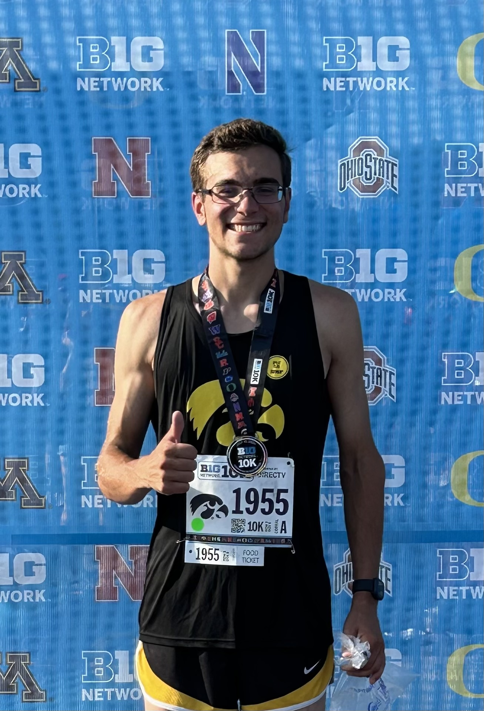

# Project description

BeaconHill’s dashboard web application empowers farmers with real-time insights drawn directly from their fields. Utilizing a network of in-field sensors, the system continuously collects key data such as soil moisture, temperature, and other vital environmental factors. This information is synthesized and displayed through an intuitive dashboard, enabling informed decisions to optimize resource usage, reduce costs, and improve crop yields.

The application focuses on two core objectives: collecting real-time field measurements and providing historical data visualizations to uncover trends and predict future farm conditions. By making even incremental improvements in crop yield and resource allocation, BeaconHill helps farmers enhance profitability and sustainability at scale. As agriculture evolves, this solution equips producers with the tools needed to thrive in a data-driven future.

 
# Authors

<table>
  <tr>
    <td align="center" style="padding:16px">
       
      <strong>
        <a href="https://www.linkedin.com/in/steven-austin-069a593a5/" target="_blank">Steven Austin</a>
      </strong>
    </td>
    <td align="center" style="padding:16px">
       
      <strong>
        <a href="http://linkedin.com/in/sage-marks" target="_blank">Sage Marks</a>
      </strong>
    </td>
    <td align="center" style="padding:16px">
       
      <strong>
        <a href="https://www.linkedin.com/in/zackmulholland/" target="_blank">Zack Mulholland</a>
      </strong>
    </td>
    <td align="center" style="padding:16px">
       
      <strong>
        <a href="http://linkedin.com/in/matt-krueger" target="_blank">Matt Krueger</a>
      </strong>
    </td>
  </tr>
</table>

# Repository structure

Root layout and where key tooling lives: **[docs/PROJECT_STRUCTURE.md](./docs/PROJECT_STRUCTURE.md)**.

# Running the project

## Local development

To run the app on your machine in **testing mode** (no login, mock data) or **production mode** (login required, real AWS backend), use the instructions and commands in:

**[DEVELOPMENT_MODES.md](./docs/DEVELOPMENT_MODES.md)**

Summary:

- **Testing:** `npm run start:test` → app at http://localhost:3000, no sign-in, mock data only.
- **Production (local):** `npm start` or `npm run start:prod` → app at http://localhost:3000, Cognito sign-in, live API.

## Live deployment (AWS)

The app is hosted on AWS Amplify. Open the live site here:

**[Beacon Hill (AWS) NOT AVAILABLE -- YET]()**

*If your team uses a different branch (e.g. `dev`) or a custom domain, update this link. The Amplify App ID for this project is `d3lv3c6ppm80xp`.*