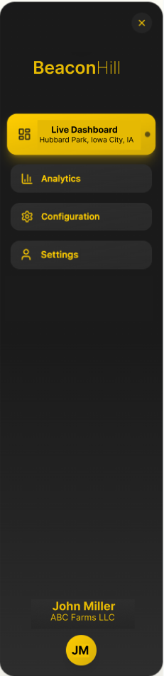

# Sidebar Component
The sidebar is the primary method to navigate within the BeaconHill web application.

  

    
    Expanded
  

  

    
    Collapsed
  

The sidebar sketch provided is not 100% correct; there will not be an icon, but only the text: BeaconHill. The text "Beacon" shall be weighted extra-bold, and the text "Hill" weighted extra-light. The text color should be Yellow Accent

-- 

There shall be 4 buttons that map to the four pages:
1. Live Dashboard
2. Analytics
3. Configuration
4. Settings

The sidebar should have two states:
1. expanded - this state should fill a sizeable amount of the left-hand-side of the screen 
2. collapsed - this will collapse the sidebar to the size of the open/close icon only. Additionally, only the icons for the pages and user profile should be shown

For the coloring, please use the [THEME.md](./../../../docs/THEME.md). 

Additionally, at the very bottom, there should be name of the user that is currently logged in, and the farm that is logged in. A profile image (see [PROFILE_IMAGE_COMPONENT.md](./../ProfileImageComponent/PROFILE_IMAGE_COMPONENT.md)) should also be shown.