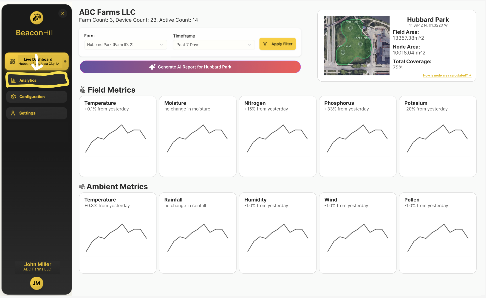

# Analytics Page

The Analytics page compares farm sensor values with ambient environmental data for a selected farm.

## Page Structure

The page is split into a parent container plus three mode-specific views:

- `AnalyticsPage.js`  
  - Renders page header and controls.
  - Selects active farm from `MeasurementsContext` (`useMeasurements()`).
  - Passes selected farm coordinates (`lat`, `lon`) to child views.
  - Switches view with a `ToggleButtonGroup`: `current`, `week`, `projection`.

- `AnalyticsCurrent.js`
  - Displays current farm dummy values (`DUMMY_FARM_CURRENT`) and current ambient weather.
  - Uses `useFarmWeather(lat, lon, 'current')`.

- `AnalyticsWeek.js`
  - Displays weekly farm dummy values (`DUMMY_FARM_WEEK`) and weekly-aggregated ambient weather.
  - Uses `useFarmWeather(lat, lon, 'week')`.

- `AnalyticsProjection.js`
  - Displays side-by-side comparison tables (node vs modeled API values).
  - Fetches Open-Meteo weather, air quality, and elevation endpoints directly.

## Data Sources

- Farm selection and coordinates come from `MeasurementsContext` (`farms[]` with `farmId`, `farmName`, `lat`, `lon`).
- Farm values shown on Current/Week are currently dummy values from `src/data/analyticsDummyFarm.js`.
- Projection "node" values currently reuse `DUMMY_FARM_CURRENT` for comparison.

## API Usage

### Current + Week Ambient Data

Ambient weather for `current` and `week` modes is fetched through `useFarmWeather`:

- Hook: `src/hooks/useFarmWeather.js`
- API wrapper: `src/api/weatherApi.js`
- Provider: [WeatherAPI](https://www.weatherapi.com/)

Environment variable required:

- `REACT_APP_WEATHER_API_KEY`

Calls made:

- Current conditions:
  - `GET https://api.weatherapi.com/v1/current.json?key=...&q={lat},{lon}`
- 7-day forecast:
  - `GET https://api.weatherapi.com/v1/forecast.json?key=...&q={lat},{lon}&days=7`

Normalized ambient fields used by the UI:

- `temperatureF`
- `humidity`
- `rainfallIn`
- `windMph`
- `uvIndex`

For `week` mode, forecast days are aggregated via `aggregateForecastWeek()`.

### Projection Data (Open-Meteo)

Projection mode calls Open-Meteo APIs directly (in `AnalyticsProjection.js`):

- Weather forecast/current modeled fields:
  - `https://api.open-meteo.com/v1/forecast?...&current=temperature_2m,relative_humidity_2m,precipitation,evapotranspiration,vapour_pressure_deficit,soil_temperature_0cm,soil_moisture_0_to_1cm`
- Air quality current fields:
  - `https://air-quality-api.open-meteo.com/v1/air-quality?...&current=ammonia,nitrogen_dioxide`
- Elevation:
  - `https://api.open-meteo.com/v1/elevation?latitude={lat}&longitude={lon}`

If farm coordinates are missing, projection falls back to:

- `lat = 41.6611`
- `lon = -91.5302`

## Error and Empty-State Behavior

- `Current`/`Week`: show loading spinner while fetching, and show error/empty messaging when data is unavailable.
- `Projection`: uses `Promise.allSettled` so partial API failures can still render available sections; endpoint-specific errors are shown inline.

## Related Components

- Header: [HEADER_COMPONENT.md](./../../components/HeaderComponent/HEADER_COMPONENT.md)