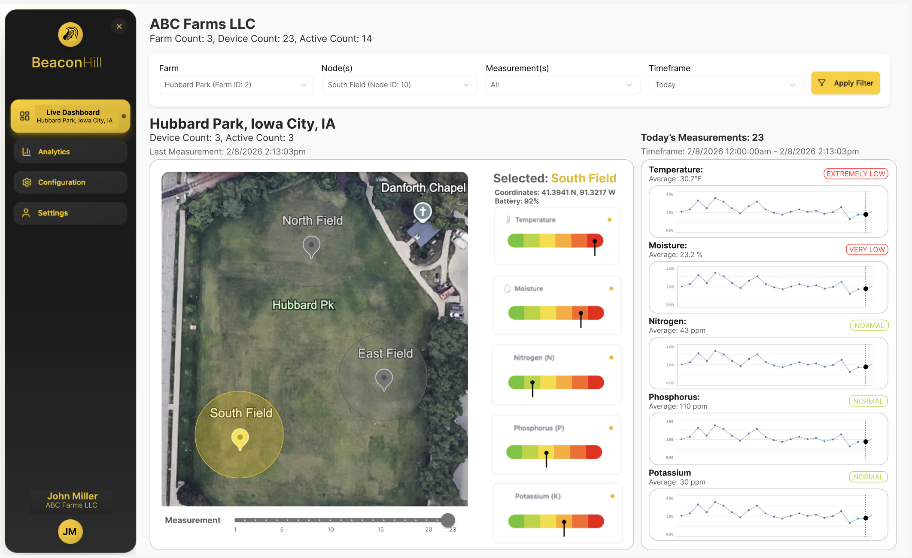

# Live Dashboard Page
The Live Dashboard Page is the landing page of the BeaconHill web-application. The Live Dashboard page shows the live view of the farm selected. The users is able to select a Farm, Nodes, and Timeframe. 

Please note that this dashboard page is not correct. There are only three filters: Farm, Node(s), and Timeframe. The dashboard should have two tabs: Live View, and Measurement Averages. The Live View is the left hand, containing the map, the slider. The Measurement Averages is a grid of line charts for each nodes. Each node will have a line chart, and in each line chart plotted are all of the measurements: Temperature, Moisture, Nitrogen, Phosphorous, and Potassium.

## Data 
This page utilizes the field measurements taken by the node devices. More precisely, this page plots all of the measurements using the components. Data will be populated based on the filter selections of the user.

DynamoDB Tables Used:
- Measurements

The measurements will be filtered on the Farm, Node(s), and Timeframe selections. Each entry will contain these fields and will be used to select wanted measurement records.

## Components
- Header: [HEADER_COMPONENT.md](./../../components/HeaderComponent/HEADER_COMPONENT.md)
- Tab: N/A. Tab component should be from a component library

Live View Components:
- Map: [MAP_COMPONENT.md](./../../components/MapComponent/MAP_COMPONENT.md)
- Slider: [SLIDER_COMPONENT.md](./../../components/SliderComponent/SLIDER_COMPONENT.md)
- Linear Gauge Chart: [LINEAR_GAUGE_COMPONENT.md](./../../components/LinearGaugeComponent/LINEAR_GAUGE_COMPONENT.md)

Measurement Averages:
- Analytics All Measurements: [ANALYTICS_CARD.md](./../../components/AnalyticsCardComponent/ANALYTICS_CARD.md)
