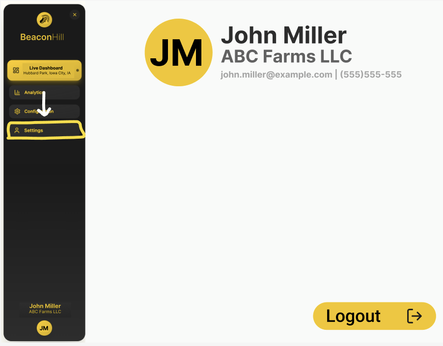

# Settings Page
Currently, the settings page is minimal, providing only a way to logout of the BeaconHill website.

## Data
This page only utilizes the user and farm data

DynamoDB Tables Used:
- Farm
- User

### Components
- Profile Image: [PROFILE_IMAGE_COMPONENT.md](./../../components/ProfileImageComponent/PROFILE_IMAGE_COMPONENT.md)
- Header: [HEADER_COMPONENT.md](./../../components/HeaderComponent/HEADER_COMPONENT.md)
- Button: [BUTTON_COMPONENT.md](./../../components/ButtonComponent/BUTTON_COMPONENT.md)